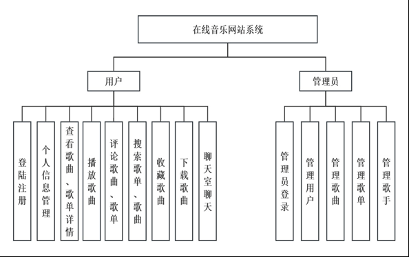
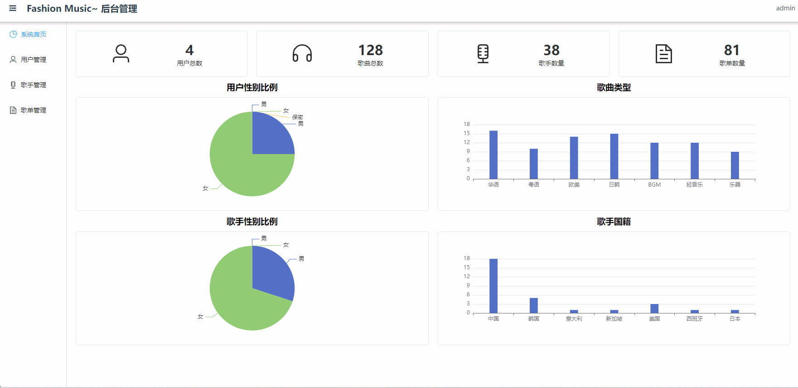

# online-music🎂

基于SpringBoot+Vue的流行音乐平台

## 介绍🌞

> 本系统通过使用SpringBoot、Vue等前后端开发框架，基本实现了音乐网站的基本功能。并且，本系统区别于其他在线音乐网站的显著特点是运用了WebSocket技术在音乐网站内部搭建了简易的在线聊天室。在聊天室页面中，可以展现当前的在线用户，并且用户的进入与退出均有系统提示，极大地方便了用户的线上交流。完成了用户注册登录，歌曲展示、播放、收藏、下载、评论及管理，歌单、歌手的展示与管理，歌单评分及评论，在线聊天室中用户发送与接收信息、用户在线列表的更新等功能，用户信息展示与修改，以及页面搜索功能等多个模块功能。

## 软件架构



## 项目演示🌞

>  管理员

在后台管理界面，管理员拥有全面的监控与操作权限。他们可以直观地查看系统当前的用户总数、歌曲库存量等关键信息。通过左侧的导航菜单，管理员能够轻松选择并访问不同的管理模块，这些模块分别对应着用户管理、歌曲库管理及歌单管理等功能。在各个管理页面中，管理员可以执行一系列操作，包括但不限于用户信息的查看与编辑、歌曲的上传与下架、歌单的创建与调整，以此实现对整个系统内容的精细化管理和维护




> 管理员

在系统的前端用户界面，对于未登录的访客，系统仅开放有限的功能体验，比如基础的音乐播放与搜索服务。而一旦用户完成登录流程，他们将解锁全部功能权限。登录后的用户，不仅能够通过点击首页上的歌单或歌曲实现页面跳转，直接播放所选择的曲目，还享有对音乐播放的完全控制权，包括暂停、切换曲目、调整音量大小、下载歌曲以及将喜爱的歌曲加入收藏夹。此外，用户还能积极参与互动，对歌单及歌曲发表评论，分享个人见解。更进一步，系统还提供了在线聊天室功能，允许用户轻松点击即可进入，与其他用户进行即时、便捷的在线交流，增强了社区互动体验。


## 安装教程🌞

```
1. 运行环境准备mysql8 + java8 + node14.16.1

2. 配置maven路径，加载依赖

3. 运行sql文件，确保application.yml或config.properties的数据库名称和账号密码是数据库所在主机的账号密码
```


## 使用说明🌞

```
1. 登入

	管理员账号：admin	密码：123456
	
    客户账号：user 密码：123456
  
2. 运行流程

SpringBoot+Vue项目的部署详情可以查看这篇CSDN博客：http://t.csdnimg.cn/kpuxS

前后端不分离项目的部署流程可以查看这篇CSDN博客：http://t.csdnimg.cn/CslA5
```


## CSDN项目合集🌞

点击前往：http://t.csdnimg.cn/Q4u84


## 联系我🌞

**有偿获取完整源码或调试代码**

🐧：1902317191

微信：


